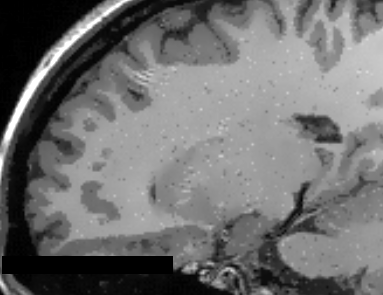
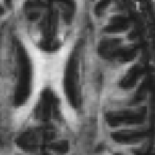
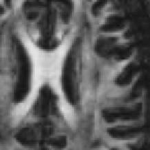

# Anomalous Diffusion Filters

{ width="250" .center}

Welcome to the Anomalous Diffusion Filters Slicer Extension!

Anomalous diffusion processes (ADP) are mathematically denoted by a power law in the Fokker-Planck equation, leading to the generalized form. There are several generalizations of the Fokker-Plank equation, which should give many different partial differential equations (PDEs). Here we adopted the so-called porous media equation, allowing the super-diffusive and the sub-diffusive processes [^1]. In porous media, channels are created promoting or blocking the flow of the density function, which has been proved to provide a suitable application for MRI noise attenuation [^2].

Basically, there are two different filters already implementing the anomalous diffusion process: the isotropic anomalous diffusion and anisotropic anomalous diffusion filters [^2]. These filters were already applied on different imaging MR modalities, such as structural T1 and T2 images [^2], diffusion-weighted images (DWI and DTI)[^3][^4], MRI relaxation T1 and T2 relaxometry[^5] and to fMRI[^6] as an initial study.

[^1]: Tsallis, C. (2009). Introduction to Nonextensive Statistical Mechanics: Approaching a Complex World. Springer.

[^2]: Da S Senra Filho, A. C., Garrido Salmon, C. E., & Murta Junior, L. O. (2015). Anomalous diffusion process applied to magnetic resonance image enhancement. Physics in Medicine and Biology, 60(6), 2355–2373. [doi:10.1088/0031-9155/60/6/2355](https://doi.org/10.1088/0031-9155/60/6/2355)

[^3]: Senra Filho, A. C. da S., Duque, J. J., & Murta, L. O. (2013). Isotropic anomalous filtering in Diffusion-Weighted Magnetic Resonance Imaging. Conference Proceedings: Annual International Conference of the IEEE Engineering in Medicine and Biology Society. IEEE Engineering in Medicine and Biology Society. Conference, 2013, 4022–5. [doi:10.1109/EMBC.2013.6610427](https://doi.org/10.1109/EMBC.2013.6610427)

[^4]: Senra Filho, A. C. da S., Simozo, F. H., Salmon, C. E. G., & Murta Junior, L. O. (2014). Anisotropic anomalous filter as a tool for decreasing patient exam time in diffusion-weighted MRI protocols. In XXIV Brazilian Congress on Biomedical Engineering (pp. 0–3). Uberlandia

[^5]: Filho, A. C. da S. S., Barbosa, J. H. O., Salmon, C. E. G. S., & Junior, L. O. M. (2014). Anisotropic Anomalous Diffusion Filtering Applied to Relaxation Time Estimation in Magnetic Resonance Imaging. In Annual International Conference of the IEEE Engineering in Medicine and Biology Society (pp. 3893–3896). IEEE. [doi:10.1109/EMBC.2014.6944474](https://doi.org/10.1109/EMBC.2014.6944474)

[^6]: Filho, A. C. da S. S., Rondinoni, C., Santos, A. C. dos, & Junior, L. O. M. (2014). Brain Activation Inhomogeneity Highlighted by the Isotropic Anomalous Diffusion Filter. In Annual International Conference of the IEEE Engineering in Medicine and Biology Society (pp. 3313–3316). Chicago: IEEE. [doi:10.1109/EMBC.2014.6944331](https://doi.org/10.1109/EMBC.2014.6944331)

## Use Cases

Most frequently used for these scenarios:

- **Use Case 1:** Noise reduction as a pre-processing step for tissue segmentation
    
    - When dealing with single voxel classification schemes, a noise reduction pre-processing step is usually helpful to reduce data fluctuation due to acquisition artifacts (e.g. reducing the number of misclassified voxels).

- **Use Case 2:** Volume rendering
    
    - Noise reduction will result in nicer looking volume renderings

- **Use Case 3:** Noise reduction as part of image processing pipeline
    
    - Could offer a better segmentation and classification on specific brain image analysis such as in Multiple Sclerosis lesion segmentation

{ width="300" .center}

Raw T1 weighted MRI Image

{ width="300" .center}

T1 weighted MRI Image with AAD filter (q=1.2)

{ width="300" .center}

DTI-FA map without image filtering process

{ width="300" .center}

DTI-FA map with AAD image filtering (q=0.4)

## Cite this tool

We hope that the `Anomalous Diffusion Filters` can be helpful for your applications. If possible, recall to cite at least one of the following publications:

* Da S Senra Filho, A. C., Garrido Salmon, C. E., & Murta Junior, L. O. (2015). Anomalous diffusion process applied to magnetic resonance image enhancement. Physics in Medicine and Biology, 60(6), 2355–2373. [doi:10.1088/0031-9155/60/6/2355](https://doi.org/10.1088/0031-9155/60/6/2355)
* Filho, A. C. da S. S., Rondinoni, C., Santos, A. C. dos, & Junior, L. O. M. (2014). Brain Activation Inhomogeneity Highlighted by the Isotropic Anomalous Diffusion Filter. In Annual International Conference of the IEEE Engineering in Medicine and Biology Society (pp. 3313–3316). Chicago: IEEE. [doi:10.1109/EMBC.2014.6944331](https://doi.org/10.1109/EMBC.2014.6944331)

## License

This project is under Apache version 2.0 license and following details are given at the [LICENSE](https://github.com/CSIM-Toolkits/AnomalousFiltersExtension/blob/main/LICENSE) file in the project repository.